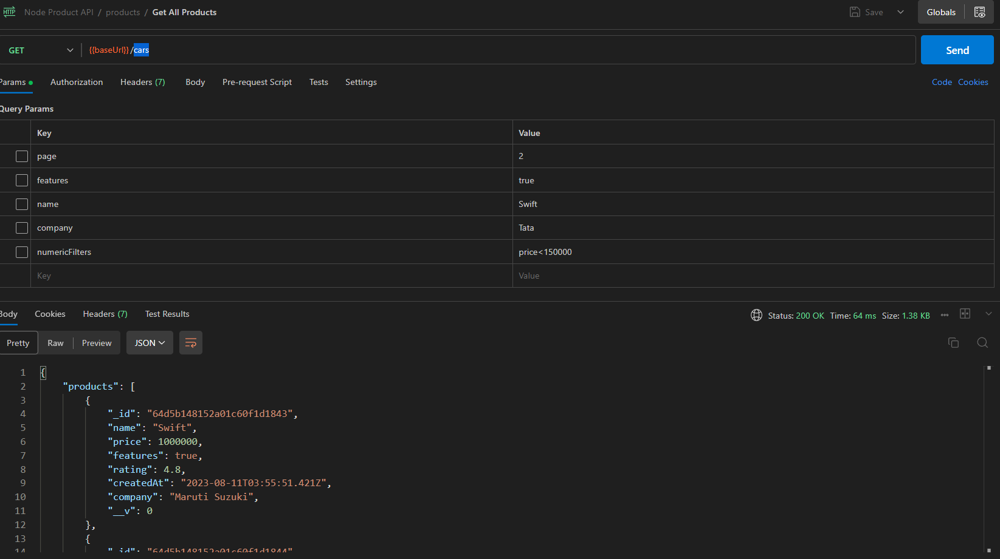

## Car API

This project is used to get a car listing API for an e-commerce site. Data fetches are basically paginated systems. We can perform various filterable actions. Filter by features, name, company, price, rating, etc. We can also sort the data. It will be connected using the front-end framework React or Vue later.

## Functionalities

--Get cars by pagination
--Filter cars
--Sort cars

## setup the app

clone or fetch the app

cd car-api-node

npm start

## API Reference for Auth

#### Register API

## API Reference

```http
 Methods =>  GET
  http://localhost:4000/api/v1/cars
```

## Authors

- [@octokatherine](https://www.github.com/KaziHasin)


